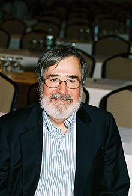

<table class="infobox biography vcard">
<tbody>
<tr>
<th colspan="2">

Edmund Melson Clarke, Jr.

</th>
</tr>
<tr>
<td colspan="2"></td>
</tr>
<tr>
<th scope="row">Born</th>
<td>July 27, 1945</td>
</tr>
<tr>
<th scope="row">Nationality</th>
<td class="category">American</td>
</tr>
<tr>
<th scope="row">Alma&nbsp;mater</th>
<td><a title="Cornell University" href="https://en.wikipedia.org/wiki/Cornell_University">Cornell University</a></td>
</tr>
<tr>
<th scope="row">Known&nbsp;for</th>
<td><a title="Model checking" href="https://en.wikipedia.org/wiki/Model_checking">Model checking</a></td>
</tr>
<tr>
<th scope="row">Awards</th>
<td><a title="Turing Award" href="https://en.wikipedia.org/wiki/Turing_Award">A.M. Turing Award</a></td>
</tr>
<tr>
<td colspan="2"><strong>Scientific career</strong></td>
</tr>
<tr>
<th scope="row">Fields</th>
<td class="category"><a title="Computer science" href="https://en.wikipedia.org/wiki/Computer_science">Computer science</a></td>
</tr>
<tr>
<th scope="row">Institutions</th>
<td><a title="Carnegie Mellon University" href="https://en.wikipedia.org/wiki/Carnegie_Mellon_University">Carnegie Mellon University</a></td>
</tr>
<tr>
<th scope="row"><a title="Thesis" href="https://en.wikipedia.org/wiki/Thesis">Thesis</a></th>
<td><em>Completeness and Incompleteness Theorems for Hoare-Like Axiom Systems</em>&nbsp;(1976)</td>
</tr>
<tr>
<th scope="row"><a title="" href="https://en.wikipedia.org/wiki/Doctoral_advisor">Doctoral advisor</a></th>
<td><a title="Robert Lee Constable" href="https://en.wikipedia.org/wiki/Robert_Lee_Constable">Robert Lee Constable</a></td>
</tr>
<tr>
<th scope="row">Doctoral students</th>
<td>

<ul>
<li><a title="E. Allen Emerson" href="https://en.wikipedia.org/wiki/E._Allen_Emerson">E. Allen Emerson</a></li>
<li><a title="Bhubaneswar Mishra" href="https://en.wikipedia.org/wiki/Bhubaneswar_Mishra">Bhubaneswar Mishra</a></li>
<li><a title="David L. Dill" href="https://en.wikipedia.org/wiki/David_L._Dill">David L. Dill</a></li>
</ul>

</td>
</tr>
<tr>
<th scope="row">Website</th>
<td><a class="external text" href="https://www.cs.cmu.edu/~emc" rel="nofollow">www<wbr />.cs<wbr />.cmu<wbr />.edu<wbr />/~emc</a></td>
</tr>
</tbody>
</table>
 

<strong>Edmund Melson Clarke, Jr.</strong>&nbsp;(born July 27, 1945) is an American retired&nbsp;<a title="Computer scientist" href="https://en.wikipedia.org/wiki/Computer_scientist">computer scientist</a>&nbsp;and&nbsp;<a class="mw-redirect" title="Academic" href="https://en.wikipedia.org/wiki/Academic">academic</a>&nbsp;noted for developing&nbsp;<a title="Model checking" href="https://en.wikipedia.org/wiki/Model_checking">model checking</a>, a method for formally verifying hardware and software designs. He is the&nbsp;<a title="FORE Systems" href="https://en.wikipedia.org/wiki/FORE_Systems">FORE Systems</a>&nbsp;Professor of&nbsp;<a class="mw-redirect" title="Computer Science" href="https://en.wikipedia.org/wiki/Computer_Science">Computer Science</a>&nbsp;Emeritus at&nbsp;<a title="Carnegie Mellon University" href="https://en.wikipedia.org/wiki/Carnegie_Mellon_University">Carnegie Mellon University</a>. Clarke, along with&nbsp;<a title="E. Allen Emerson" href="https://en.wikipedia.org/wiki/E._Allen_Emerson">E. Allen Emerson</a>&nbsp;and&nbsp;<a title="Joseph Sifakis" href="https://en.wikipedia.org/wiki/Joseph_Sifakis">Joseph Sifakis</a>, is a recipient of the 2007&nbsp;<a title="Association for Computing Machinery" href="https://en.wikipedia.org/wiki/Association_for_Computing_Machinery">Association for Computing Machinery</a>&nbsp;<a title="Turing Award" href="https://en.wikipedia.org/wiki/Turing_Award">A.M. Turing Award</a>.

 
<h2> Publications </h2>

<ul>

 <li><a target="_blank" href="https://github.com/manjunath5496/Edmund-Melson-Clarke-Publications/blob/master/clarke(1).pdf" style="text-decoration:none;">Verfication of the Futurebus+cache coherence protocol</a></li>

 <li><a target="_blank" href="https://github.com/manjunath5496/Edmund-Melson-Clarke-Publications/blob/master/clarke(2).pdf" style="text-decoration:none;">Automatic verification of finite-state concurrent systems using temporal logic specifications</a></li>

<li><a target="_blank" href="https://github.com/manjunath5496/Edmund-Melson-Clarke-Publications/blob/master/clarke(3).pdf" style="text-decoration:none;">Design and synthesis of synchronization skeletons using branching time  temporal logic</a></li>
 <li><a target="_blank" href="https://github.com/manjunath5496/Edmund-Melson-Clarke-Publications/blob/master/clarke(4).pdf" style="text-decoration:none;">Bounded Model Checking Using Satisfiability Solving</a></li>                              
<li><a target="_blank" href="https://github.com/manjunath5496/Edmund-Melson-Clarke-Publications/blob/master/clarke(5).pdf" style="text-decoration:none;">Symbolic model checking: 1020 states and beyond</a></li>
<li><a target="_blank" href="https://github.com/manjunath5496/Edmund-Melson-Clarke-Publications/blob/master/clarke(6).pdf" style="text-decoration:none;">Verification tools for finite-state concurrent systems</a></li>
 <li><a target="_blank" href="https://github.com/manjunath5496/Edmund-Melson-Clarke-Publications/blob/master/clarke(7).pdf" style="text-decoration:none;">Counterexample-Guided Abstraction Refinement for Symbolic Model Checking</a></li>

 <li><a target="_blank" href="https://github.com/manjunath5496/Edmund-Melson-Clarke-Publications/blob/master/clarke(8).pdf" style="text-decoration:none;"> The Birth of Model Checking </a></li>
   </ul>
